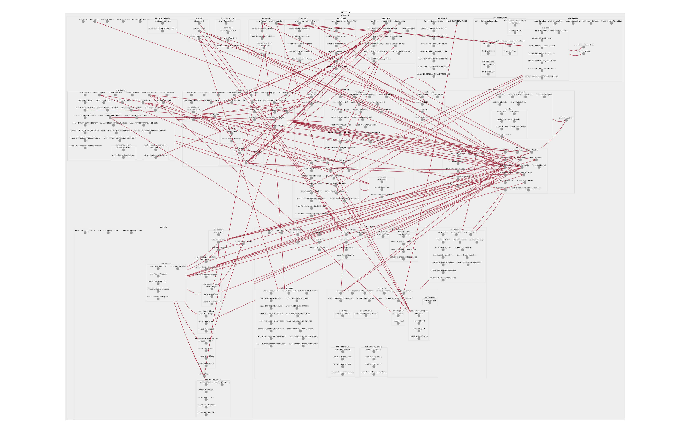
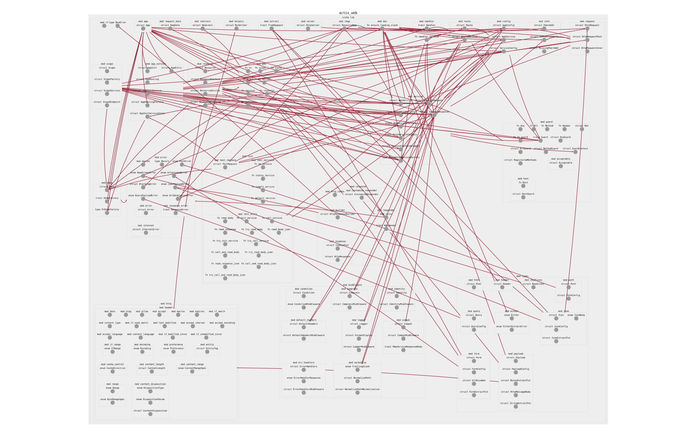
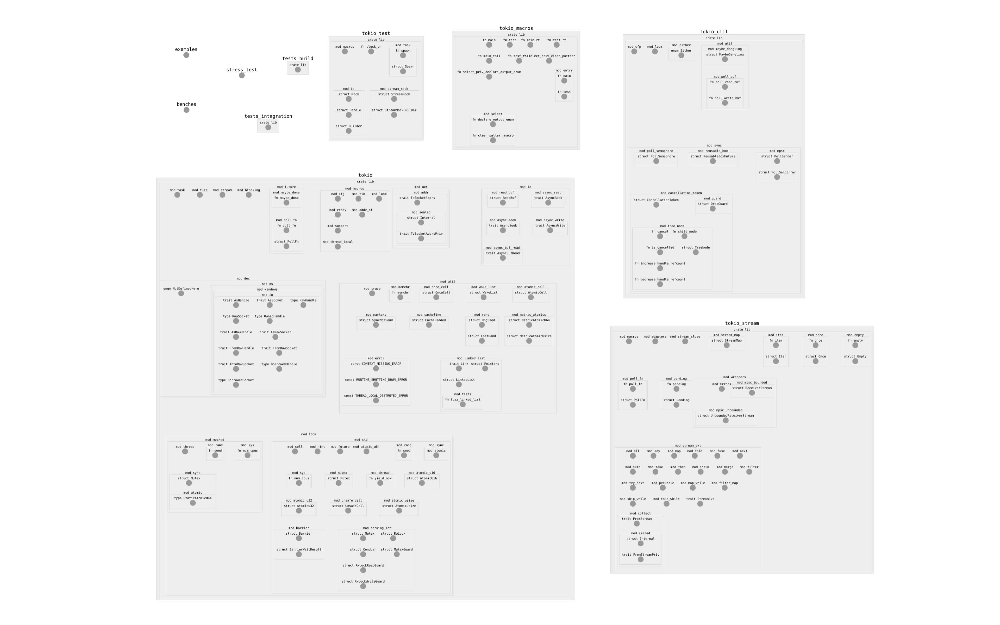
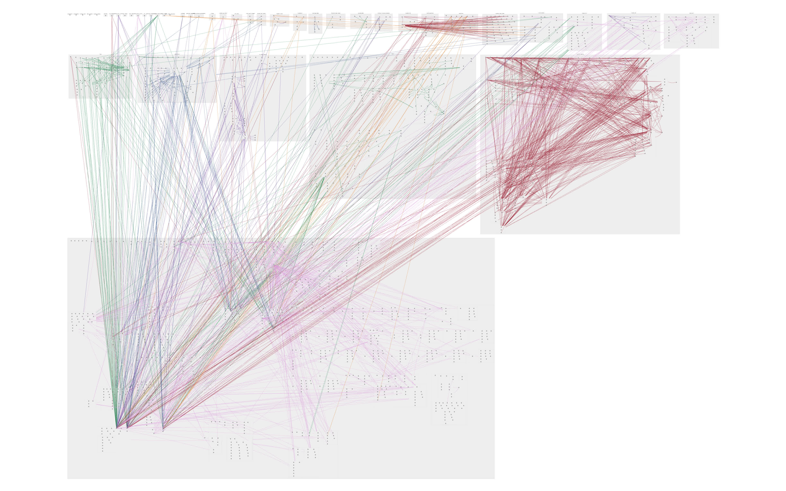

# `rust-ontologist`

Navigating through a big codebase is hard, especially when you are just learning it. IDEs make it simpler, but they do not show the "real" project structure, with all inter-module dependencies and such. `rust-ontologist` comes to the rescue: it generates a structure, or _ontology_, of any Rust project, and visualizes it in an interactive browser window.

`rust-ontologist` is fast enough to handle a project of any scale, including the Rust compiler itself, which we demonstrate below.

## Usage

Clone the repository:

```
$ git clone https://github.com/lava-xyz/rust-ontologist.git
$ cd rust-ontologist
```

Run the following command to generate a _project structure dump_ in JSON:

```
$ cargo run -- -p <your-cargo-project>
```

Run a static server on port 80 (make sure `http-server` is installed: `npm install http-server`):

```
$ sudo http-server . -p 80 --cors
```

Finally, open http://localhost/index.html and see the result!

## Gallery

To enable coloured edges, provide the flag `--enable-edges`. Note that not all module dependencies are shown at the moment.

### [`rust-bitcoin/bitcoin`] (edges enabled)



[`rust-bitcoin/bitcoin`]: https://github.com/rust-bitcoin/rust-bitcoin/tree/master/bitcoin

### [`actix-web/actix-web`] (edges enabled)



[`actix-web/actix-web`]: https://github.com/actix/actix-web/tree/master/actix-web

### [`tokio`] (edges disabled)



[`tokio`]: https://github.com/tokio-rs/tokio

### [`rust`] (edges enabled)



[`rust`]: https://github.com/rust-lang/rust

## Contributing

Just fork the repository, work in your own branch, and open a pull request on `master`. When submitting changes, please prefer rebasing the branch to keep the commit history as clean as possible.

## TODOs

 - Think about packaging `rust-ontologist` on crates.io. We have this `index.html` file, what to do with it?
 - Show more information in the graph: comments, types, etc. We need hide/unhide functionality for this.
 - Implement various code quality metrics based on graph manipulation.
 - Automatically suggest changes that are likely to improve a project's architecture.
 - Integrate with Git and GitHub: add a UI for commits, issues, PRs, show exact code locations of items, etc.
 - Experiment with nicer-looking but fast UI.
